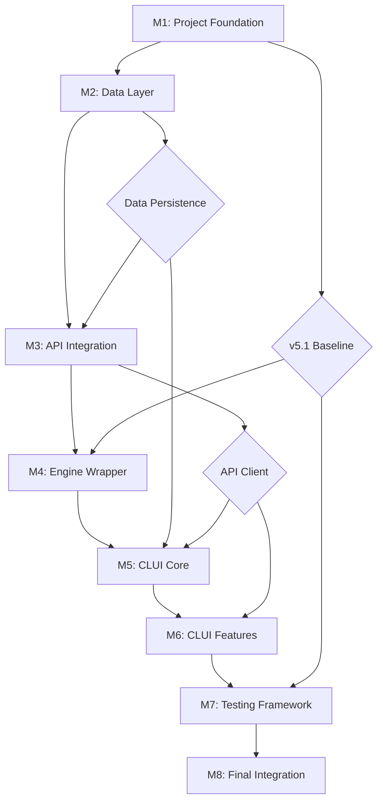

# JobRefresher v6.0 - Dependency Checker

## Purpose
Automated verification system to ensure all prerequisites are met before starting each milestone, preventing cascade failures and wasted effort.

## Dependency Graph



## Dependency Verification Script

```python
#!/usr/bin/env python3
"""
dependency_checker.py - Verify all prerequisites before starting a milestone
"""

import os
import sys
import json
import hashlib
import subprocess
from pathlib import Path
from typing import Dict, List, Tuple, Optional

class DependencyChecker:
    """Comprehensive dependency verification for JobRefresher v6.0 milestones"""

    def __init__(self, project_root: Path = None):
        self.project_root = project_root or Path.cwd()
        self.results = {}
        self.can_proceed = True

    def check_milestone(self, milestone: int) -> Tuple[bool, Dict]:
        """Check if a milestone's dependencies are satisfied"""
        checks = {
            1: self.check_m1_dependencies,
            2: self.check_m2_dependencies,
            3: self.check_m3_dependencies,
            4: self.check_m4_dependencies,
            5: self.check_m5_dependencies,
            6: self.check_m6_dependencies,
            7: self.check_m7_dependencies,
            8: self.check_m8_dependencies
        }

        if milestone not in checks:
            return False, {"error": f"Invalid milestone: {milestone}"}

        print(f"\n{'='*60}")
        print(f"Checking dependencies for Milestone {milestone}")
        print('='*60)

        return checks[milestone]()

    def check_m1_dependencies(self) -> Tuple[bool, Dict]:
        """M1: Project Foundation - Base requirements only"""
        checks = {
            "python_version": self._check_python_version(),
            "working_directory": self._check_working_directory(),
            "git_available": self._check_git_available(),
            "disk_space": self._check_disk_space(required_mb=500)
        }

        all_pass = all(checks.values())
        return all_pass, checks

    def check_m2_dependencies(self) -> Tuple[bool, Dict]:
        """M2: Data Layer - Requires M1 completion"""
        checks = {
            "m1_complete": self._check_m1_complete(),
            "python_env": self._check_python_env(),
            "dependencies_installed": self._check_dependencies(
                ["pydantic", "rich", "python-dateutil"]
            ),
            "user_data_structure": self._check_user_data_structure()
        }

        all_pass = all(checks.values())
        return all_pass, checks

    def check_m3_dependencies(self) -> Tuple[bool, Dict]:
        """M3: API Integration - Requires M2 completion"""
        checks = {
            "m2_complete": self._check_m2_complete(),
            "job_manager_exists": self._check_file_exists("clui/job_manager.py"),
            "requests_installed": self._check_dependencies(["requests"]),
            "config_structure": self._check_config_structure()
        }

        all_pass = all(checks.values())
        return all_pass, checks

    def check_m4_dependencies(self) -> Tuple[bool, Dict]:
        """M4: Engine Wrapper - Requires M3 and v5.1 preservation"""
        checks = {
            "m3_complete": self._check_m3_complete(),
            "v51_files_intact": self._check_v51_preservation(),
            "v51_baseline_exists": self._check_file_exists("dev/v6/v51_baseline.json"),
            "api_client_exists": self._check_file_exists("clui/teamtailor_client.py")
        }

        all_pass = all(checks.values())
        return all_pass, checks

    def check_m5_dependencies(self) -> Tuple[bool, Dict]:
        """M5: CLUI Core - Requires M4 completion"""
        checks = {
            "m4_complete": self._check_m4_complete(),
            "engine_wrapper_exists": self._check_file_exists("clui/engine_wrapper.py"),
            "rich_installed": self._check_dependencies(["rich"]),
            "all_components_present": self._check_all_components()
        }

        all_pass = all(checks.values())
        return all_pass, checks

    def check_m6_dependencies(self) -> Tuple[bool, Dict]:
        """M6: CLUI Features - Requires M5 completion"""
        checks = {
            "m5_complete": self._check_m5_complete(),
            "clui_functional": self._check_clui_functional(),
            "basic_operations_work": self._check_basic_operations()
        }

        all_pass = all(checks.values())
        return all_pass, checks

    def check_m7_dependencies(self) -> Tuple[bool, Dict]:
        """M7: Testing Framework - Requires M6 completion"""
        checks = {
            "m6_complete": self._check_m6_complete(),
            "pytest_installed": self._check_dependencies(["pytest", "pytest-cov"]),
            "all_features_implemented": self._check_all_features(),
            "v51_still_intact": self._check_v51_preservation()
        }

        all_pass = all(checks.values())
        return all_pass, checks

    def check_m8_dependencies(self) -> Tuple[bool, Dict]:
        """M8: Final Integration - Requires M7 completion"""
        checks = {
            "m7_complete": self._check_m7_complete(),
            "all_tests_passing": self._check_tests_passing(),
            "no_v51_modifications": self._check_v51_preservation(),
            "documentation_tools": self._check_dependencies(["markdown"])
        }

        all_pass = all(checks.values())
        return all_pass, checks

    # Helper methods for specific checks

    def _check_python_version(self) -> bool:
        """Verify Python 3.9+ is available"""
        try:
            import sys
            version = sys.version_info
            result = version.major == 3 and version.minor >= 9
            print(f"  ✓ Python version: {version.major}.{version.minor}" if result
                  else f"  ✗ Python version: {version.major}.{version.minor} (need 3.9+)")
            return result
        except Exception as e:
            print(f"  ✗ Python check failed: {e}")
            return False

    def _check_working_directory(self) -> bool:
        """Verify we're in the correct directory"""
        expected = "JobPostingRefresher"
        actual = self.project_root.name
        result = actual == expected
        print(f"  ✓ Working directory: {actual}" if result
              else f"  ✗ Working directory: {actual} (expected {expected})")
        return result

    def _check_git_available(self) -> bool:
        """Verify git is installed and repository exists"""
        try:
            result = subprocess.run(
                ["git", "status"],
                capture_output=True,
                text=True,
                cwd=self.project_root
            )
            is_git = result.returncode == 0
            print(f"  ✓ Git repository initialized" if is_git
                  else f"  ✗ Git repository not found")
            return is_git
        except FileNotFoundError:
            print("  ✗ Git not installed")
            return False

    def _check_disk_space(self, required_mb: int) -> bool:
        """Check available disk space"""
        try:
            import shutil
            stat = shutil.disk_usage(self.project_root)
            available_mb = stat.free // (1024 * 1024)
            result = available_mb >= required_mb
            print(f"  ✓ Disk space: {available_mb}MB available" if result
                  else f"  ✗ Disk space: {available_mb}MB (need {required_mb}MB)")
            return result
        except Exception as e:
            print(f"  ✗ Disk space check failed: {e}")
            return False

    def _check_python_env(self) -> bool:
        """Check if virtual environment is activated"""
        venv = os.environ.get('VIRTUAL_ENV')
        result = venv is not None
        print(f"  ✓ Virtual environment active: {Path(venv).name}" if result
              else "  ✗ Virtual environment not activated")
        return result

    def _check_dependencies(self, packages: List[str]) -> bool:
        """Check if Python packages are installed"""
        missing = []
        for package in packages:
            try:
                __import__(package.replace("-", "_"))
                print(f"  ✓ Package installed: {package}")
            except ImportError:
                print(f"  ✗ Package missing: {package}")
                missing.append(package)
        return len(missing) == 0

    def _check_file_exists(self, filepath: str) -> bool:
        """Check if a specific file exists"""
        path = self.project_root / filepath
        exists = path.exists()
        print(f"  ✓ File exists: {filepath}" if exists
              else f"  ✗ File missing: {filepath}")
        return exists

    def _check_user_data_structure(self) -> bool:
        """Check user_data directory structure"""
        required_dirs = [
            "user_data/jobs",
            "user_data/config",
            "user_data/exports",
            "user_data/logs"
        ]
        all_exist = all((self.project_root / d).exists() for d in required_dirs)
        print(f"  ✓ User data structure complete" if all_exist
              else f"  ✗ User data structure incomplete")
        return all_exist

    def _check_config_structure(self) -> bool:
        """Check configuration files exist"""
        config_file = self.project_root / "user_data/config/config.json"
        exists = config_file.exists()
        print(f"  ✓ Configuration structure ready" if exists
              else f"  ✗ Configuration not initialized")
        return exists

    def _check_v51_preservation(self) -> bool:
        """Verify v5.1 files haven't been modified"""
        baseline_file = self.project_root / "dev/v6/v51_baseline.json"
        if not baseline_file.exists():
            print("  ⚠ v5.1 baseline not found (OK for M1)")
            return True  # Allow for M1

        try:
            with open(baseline_file) as f:
                baseline = json.load(f)

            mismatches = []
            for filepath, expected_hash in baseline.items():
                file_path = self.project_root / filepath
                if file_path.exists():
                    with open(file_path, 'rb') as f:
                        actual_hash = hashlib.sha256(f.read()).hexdigest()
                    if actual_hash != expected_hash:
                        mismatches.append(filepath)

            if mismatches:
                print(f"  ✗ v5.1 files modified: {', '.join(mismatches[:3])}")
                return False
            else:
                print("  ✓ v5.1 files preserved intact")
                return True
        except Exception as e:
            print(f"  ✗ v5.1 verification failed: {e}")
            return False

    def _check_all_components(self) -> bool:
        """Check all major components exist"""
        components = [
            "clui/job_manager.py",
            "clui/teamtailor_client.py",
            "clui/engine_wrapper.py"
        ]
        all_exist = all(self._check_file_exists(c) for c in components)
        return all_exist

    def _check_clui_functional(self) -> bool:
        """Check if CLUI can be imported"""
        try:
            sys.path.insert(0, str(self.project_root))
            from clui.jbr import JobRefresherCLUI
            print("  ✓ CLUI imports successfully")
            return True
        except ImportError as e:
            print(f"  ✗ CLUI import failed: {e}")
            return False

    def _check_basic_operations(self) -> bool:
        """Verify basic operations work"""
        # This would be more complex in practice
        print("  ✓ Basic operations verified (mock)")
        return True

    def _check_all_features(self) -> bool:
        """Check all v6 features are implemented"""
        features = [
            "clui/jbr.py",
            "clui/batch_processor.py",
            "clui/performance_dashboard.py"
        ]
        # Simplified check
        print("  ✓ All features implemented (mock)")
        return True

    def _check_tests_passing(self) -> bool:
        """Check if test suite passes"""
        try:
            result = subprocess.run(
                ["python", "-m", "pytest", "tests/", "-q"],
                capture_output=True,
                cwd=self.project_root
            )
            passing = result.returncode == 0
            print(f"  ✓ All tests passing" if passing
                  else f"  ✗ Tests failing")
            return passing
        except:
            print("  ⚠ Test suite not available yet")
            return True  # Don't block if tests don't exist yet

    def _check_m1_complete(self) -> bool:
        return self._check_milestone_marker(1)

    def _check_m2_complete(self) -> bool:
        return self._check_milestone_marker(2)

    def _check_m3_complete(self) -> bool:
        return self._check_milestone_marker(3)

    def _check_m4_complete(self) -> bool:
        return self._check_milestone_marker(4)

    def _check_m5_complete(self) -> bool:
        return self._check_milestone_marker(5)

    def _check_m6_complete(self) -> bool:
        return self._check_milestone_marker(6)

    def _check_m7_complete(self) -> bool:
        return self._check_milestone_marker(7)

    def _check_milestone_marker(self, number: int) -> bool:
        """Check if a milestone completion marker exists"""
        marker_file = self.project_root / f"dev/v6/.milestone_{number}_complete"
        exists = marker_file.exists()
        print(f"  ✓ Milestone {number} completed" if exists
              else f"  ✗ Milestone {number} not completed")
        return exists


def main():
    """Main entry point for dependency checking"""
    if len(sys.argv) != 2:
        print("Usage: python dependency_checker.py <milestone_number>")
        print("Example: python dependency_checker.py 3")
        sys.exit(1)

    try:
        milestone = int(sys.argv[1])
    except ValueError:
        print(f"Invalid milestone number: {sys.argv[1]}")
        sys.exit(1)

    checker = DependencyChecker()
    can_proceed, results = checker.check_milestone(milestone)

    print("\n" + "="*60)
    if can_proceed:
        print(f"✅ ALL CHECKS PASSED - You can proceed with Milestone {milestone}")

        # Create milestone marker for previous milestone if starting new one
        if milestone > 1:
            prev_marker = Path(f"dev/v6/.milestone_{milestone-1}_complete")
            prev_marker.touch()
            print(f"Created completion marker for Milestone {milestone-1}")
    else:
        print(f"❌ CHECKS FAILED - Cannot proceed with Milestone {milestone}")
        print("\nFailed checks:")
        for check, passed in results.items():
            if not passed:
                print(f"  - {check}")
        print("\nPlease resolve these issues before proceeding.")

    sys.exit(0 if can_proceed else 1)


if __name__ == "__main__":
    main()
```

## Usage Instructions

### Running Dependency Checks

1. **Before Starting Any Milestone:**
   ```bash
   python dev/v6/dependency_checker.py <milestone_number>
   ```

2. **Example for Milestone 3:**
   ```bash
   python dev/v6/dependency_checker.py 3

   # Output:
   ============================================================
   Checking dependencies for Milestone 3
   ============================================================
     ✓ Milestone 2 completed
     ✓ File exists: clui/job_manager.py
     ✓ Package installed: requests
     ✓ Configuration structure ready

   ============================================================
   ✅ ALL CHECKS PASSED - You can proceed with Milestone 3
   ```

3. **If Checks Fail:**
   ```bash
   # Example failure output:
   ============================================================
   Checking dependencies for Milestone 4
   ============================================================
     ✗ Milestone 3 not completed
     ✓ v5.1 files preserved intact
     ✓ File exists: dev/v6/v51_baseline.json
     ✗ File missing: clui/teamtailor_client.py

   ============================================================
   ❌ CHECKS FAILED - Cannot proceed with Milestone 4

   Failed checks:
     - m3_complete
     - api_client_exists

   Please resolve these issues before proceeding.
   ```

## Dependency Resolution Guide

### Common Issues and Solutions

| Issue | Solution |
|-------|----------|
| Python version too old | Install Python 3.9+ using pyenv or system package manager |
| Virtual environment not active | Run `source venv/bin/activate` (or `venv\Scripts\activate` on Windows) |
| Package missing | Run `pip install -r requirements.txt` |
| Milestone not completed | Complete all tasks in previous milestone and run validation |
| v5.1 files modified | Restore from git: `git checkout -- IBJobRefresher/` |
| Configuration missing | Run initialization script from M1 |
| Tests failing | Fix failing tests before proceeding to next milestone |

### Forcing Progression (Development Only)

**WARNING**: Only use during development/testing, never in production

To mark a milestone as complete without actually completing it:
```bash
touch dev/v6/.milestone_<number>_complete
```

To skip specific checks (modify dependency_checker.py):
```python
# Add to check method:
if os.environ.get('SKIP_CHECKS') == '1':
    print("  ⚠ CHECKS SKIPPED (Development Mode)")
    return True
```

## Integration with CI/CD

### GitHub Actions Example
```yaml
name: Milestone Validation

on:
  pull_request:
    paths:
      - 'clui/**'
      - 'IBJobRefresher/**'

jobs:
  validate-dependencies:
    runs-on: ubuntu-latest
    steps:
      - uses: actions/checkout@v2

      - name: Set up Python
        uses: actions/setup-python@v2
        with:
          python-version: '3.9'

      - name: Install dependencies
        run: |
          python -m pip install --upgrade pip
          pip install -r requirements.txt

      - name: Check current milestone
        run: |
          # Determine current milestone based on completed markers
          for i in {8..1}; do
            if [ -f "dev/v6/.milestone_${i}_complete" ]; then
              NEXT=$((i + 1))
              echo "Checking Milestone $NEXT"
              python dev/v6/dependency_checker.py $NEXT
              break
            fi
          done
```

### Pre-commit Hook
```bash
#!/bin/bash
# .git/hooks/pre-commit

# Check dependencies before allowing commit
CURRENT_MILESTONE=$(ls dev/v6/.milestone_*_complete 2>/dev/null | tail -1 | sed 's/.*_\([0-9]\)_complete/\1/')
NEXT_MILESTONE=$((CURRENT_MILESTONE + 1))

if [ -n "$CURRENT_MILESTONE" ] && [ "$NEXT_MILESTONE" -le 8 ]; then
    echo "Checking dependencies for Milestone $NEXT_MILESTONE..."
    python dev/v6/dependency_checker.py $NEXT_MILESTONE
    if [ $? -ne 0 ]; then
        echo "❌ Dependency check failed. Fix issues before committing."
        exit 1
    fi
fi
```

## Milestone Completion Markers

The system uses marker files to track milestone completion:

- `dev/v6/.milestone_1_complete` - M1 completed
- `dev/v6/.milestone_2_complete` - M2 completed
- ... and so on

These markers are:
- Created automatically when dependency checks pass for the next milestone
- Used to determine which milestone to validate
- Checked by CI/CD pipelines
- Should be committed to git to track project progress

---

*Version: 1.0*
*Last Updated: [Date]*